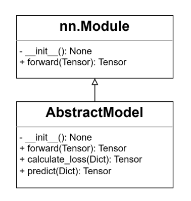
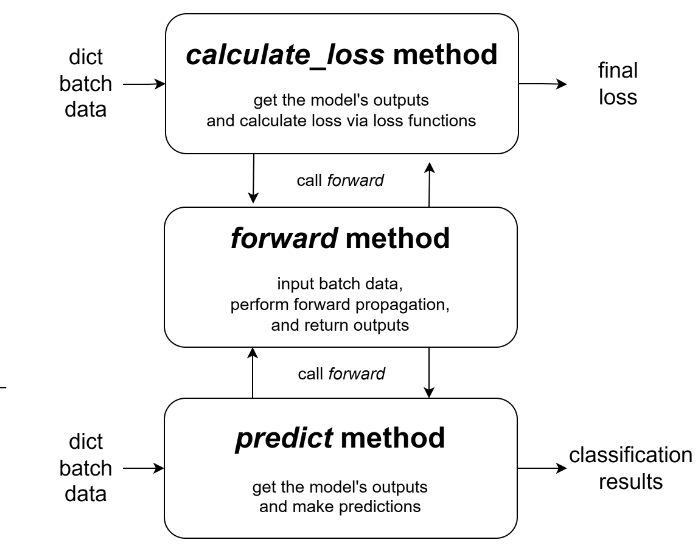

Customize Models
=================
We have formulated a comprehensive interface for all models integrated within FaKnow. The new model developed by users
should inherit from AbstractModel and override the corresponding methods as outlined in the ensuing steps.
This code snippet illustrates an example of developing a simple model with a word embedding layer and a fully connected layer,
which only uses the text in the post for detection.

.. code-block:: python

    # inherit from AbstractModel
    class NewModel(AbstractModel):

        # 1.1 consists of an Embedding layer and a fully-connected layer
        def __init__(self, word_vector):
            self.embedding = nn.Embedding.from_pretrained(word_vector)
            self.fc = nn.Linear(word_vector.shape[-1], 2)

        # 1.2 input texts for forward propogation
        def forward(self, token):
            return self.fc(self.embedding(token))

        # 2. calulate cross entropy loss
        def calculate_loss(self, data):
            loss_fn = nn.CrossEntropyLoss()
            out = self.forward(data['token'])
            return loss_fn(out, data['label'])

        # 3. softmax probability prediction
        def predict(self, data):
            out = self.forward(data['token'])
            return torch.softmax(out, dim=-1)

Implement *__init__* and *forward*
---------------------------
Since all models indirectly inherit from the nn.Module within PyTorch(shown in Figure 1), the way of
overriding the init and forward replicates the standard methodology employed while utilizing PyTorch directly. Within the init method,
various parameters are initialized and member variables relevant to the model are defined. Conversely, forward necessitates
the completion of forward propagation, encompassing the reception of an input batch comprising sample data, culminating in the generation of the output from the model’s
final layer. In this example, an embedding layer from pre-trained word vectors and a fully connected layer for text classification are defined in the init
method. Then the input text tokens are passed through these two layers in turn to get the final output of the model in the forward method.

.. centered::
    Figure 1: UML class diagram

Implement *calculate_loss*
-------------------------
As shown in Figure 2, users are expected to compose the logic code that facilitates the calculation of loss within this
method. It entails invoking forward to acquire the output from the model’s final layer and performing the loss computation
based on the ground truth associated with the samples. In scenarios where the final loss entails multiple losses, the user can also
construct a python.Dict to collectively return them. Refer to the code snippet above, the text tokens and labels are obtained from the dict
batch data according to the corresponding key respectively, and the cross-entropy is employed as the loss function to return the final loss.

.. centered::
    Figure 2: calculate loss and predict methods

Implement *predict*
------------------
Derived from the output of the forward method, users are required to return
the probability of given batch samples being classified as either true or fake news. In this code, the tokens are also
retrieved from the dictionary batch data, and the sotfmax prediction is returned based on the model’s output.