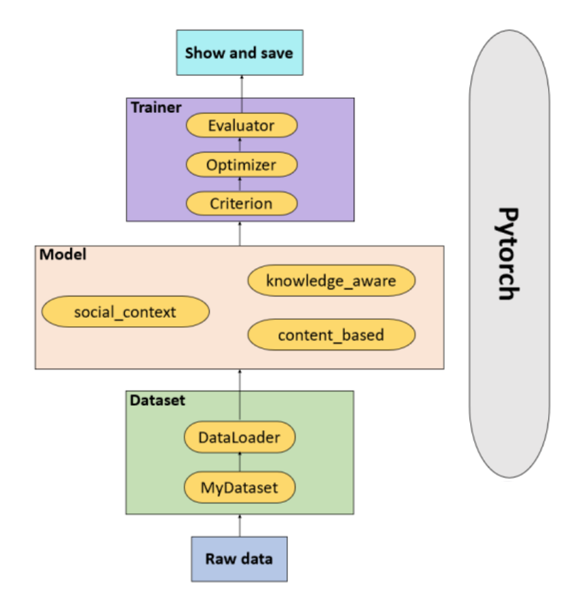

Data Flow
==========
Faknow is mainly composed of three modules: :doc:`../data_intro`, :doc:`../model_intro`, and
:doc:`../train_eval_intro`.
The data module is responsible for preprocessing the user input data and feeding it into the algorithm model module;
There are several classic false information recognition algorithms in the algorithm model module; The data is trained
through an embedded algorithm model, and the performance of the algorithm model is evaluated by verifying its various
indicators. Finally, the final algorithm model is saved.

(1) Users input raw data into the data module. In this module, the original data is transformed into PyTorch tensor format through the pre-processing class of the data set designed in advance, and the data in tensor format is finally packaged through the DataLoader class.
    For more details about data pre-processing, please read :doc:`./text_based` and :doc:`./multi_info_based`.

(2) The user selects the model in the algorithm model module and sends the data packaged in the data module to the selected algorithm model.
    For more details about model, please read :doc:`../data_intro`.

(3) Each built-in algorithm model calls the common trainers and validators in the training and validation module. After the user selects the model, loss_func, optimizer, evaluator, scheduler and determines the hyperparameters, the model begins to train and validate the data.
    For more details about training and validation, please read :doc:`../train_eval_intro`.

(4) The process in the training and validation module is presented in the form of progress bars, LOG logs, and TensorBoard, and the model is ultimately saved.
    For more details about training and validation, please read :doc:`../usage/save_and_visualization`.
