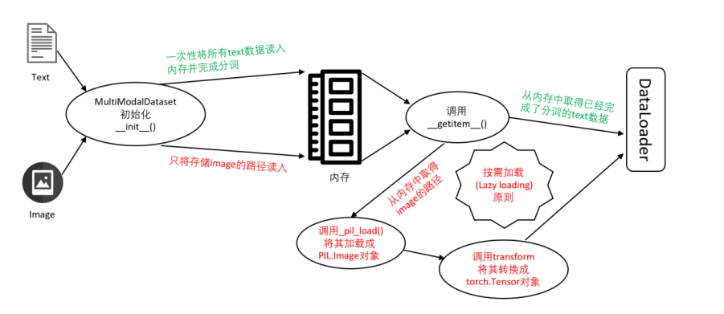

Multimodal information based false news detection
--------------------------------------------------
Faknow also adopts a unique processing method for multimodal datasets, implemented through the
`MultiModalDataset <http://127.0.0.1:8000/faknow/faknow.data.dataset.html#faknow.data.dataset.multi_modal.MultiModalDataset>`_ class.
This class inherits the `TextDataset <http://127.0.0.1:8000/faknow/faknow.data.dataset.html#faknow.data.dataset.text.TextDataset>`_ class, so it can preprocess text data. In addition, the MultiModalDataset class also
supports simultaneous image processing. By specifying the names of text and image features, as well as the corresponding
text tokenize and image transform methods, data can be transformed into the vector form required by the model,
achieving loading and preprocessing of multimodal datasets.

The MultiModalDataset class adopts two different processing approaches for text and image data. For more details about
processing methods, please read:

.. toctree::
   :maxdepth: 1

   text_data
   image_data

The MultiModalDataset class adopts the design concept of reading text at once, reading images only into storage paths,
and only reading images into memory for processing during use. It can achieve the goal of saving memory while improving
memory management to more effectively control program memory consumption during runtime. This approach also conforms to
the common usage in Python, which is 'lazy loading', only load when needed, avoiding the problem of insufficient memory
and program crashes caused by loading all image data (especially large datasets and high-resolution images) into memory
at once.

