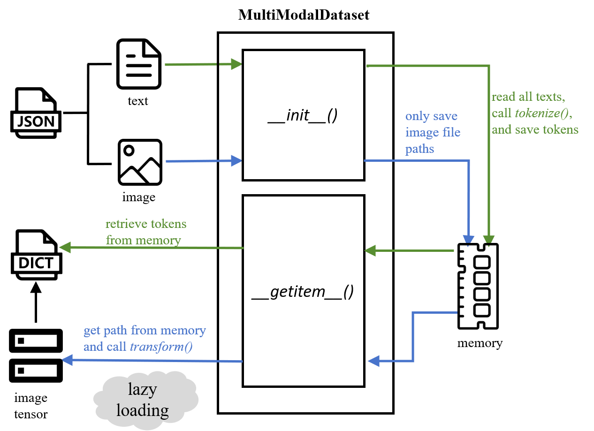

Multiple modality based fake news detection
===================================================
Faknow also adopts a unique processing method for multimodal datasets, implemented through the :ref:`MultiModalDataset <faknow.data.dataset.multi_modal>` class.
This class inherits the :ref:`TextDataset <faknow.data.dataset.text>` class, so it can preprocess text data. In addition, the MultiModalDataset class also
supports simultaneous image processing. By specifying the names of text and image features, as well as the corresponding
text tokenize and image transform methods, data can be transformed into the vector form required by the model,
achieving loading and preprocessing of multimodal datasets.

The MultiModalDataset class adopts two different processing approaches for ``text`` and ``image`` data.

Text Data
---------
For text data, the MultiModalDataset class can read and complete word segmentation at once for subsequent use.
Please refer to :ref:`Text based fake news detection <Text based fake news detection>`.

Image Data
----------
For image data, the MultiModalDataset class only stores the path of the image data during initialization and does not
read all the data into memory at once like text. It only reads the corresponding image file based on the given index
each time the ``getitem()`` method is called, and then converts it into a tensor using the predefined transform function.

The MultiModalDataset class adopts the design concept of reading text at once, reading images only into storage **paths**,
and only reading images into memory for processing during use. It can achieve the goal of saving memory while improving
memory management to more effectively control program memory consumption during runtime. This approach also conforms to
the common usage in Python, which is **lazy loading**, only load when needed, avoiding the problem of insufficient memory
and program crashes caused by loading all image data (especially large datasets and high-resolution images) into memory

.. centered::
    Figure 1: Multi-modal data processing

Since most fake news datasets are posts crawled from social platforms, and to fit the way of referencing data through feature
names mentioned above, FaKnow adopts JSON as the format of the raw data file. All sample entities are recorded as an array
in the JSON file, and each sample is a JSON object comprising key-value pairs， The Json file contains text and image data,
as shown below.  JSON data files include fields such as text, image file path, and labels.

.. code:: json

    [
        {
            "text": "this is a sentence.",
            "image": "3464577842643036.jpg"
            "domain": 9,
            "labe7": 0
        },
        {
            "text": "this is a sentence.",
            "image": "7829147156498123.jpg"
            "domain": 1,
            "label": 1
        }
    ]
