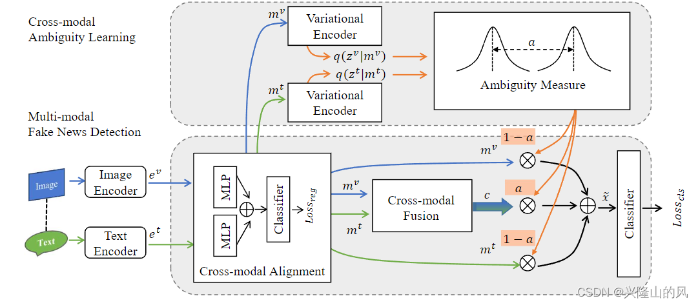

CAFE
=====
Introduction
-------------
`[paper] <https://dl.acm.org/doi/10.1145/3485447.3511968>`_

**Title:** Cross-modal Ambiguity Learning for Multimodal Fake News Detection

**Authors:** Yixuan Chen, Dongsheng Li, Peng Zhang, Jie Sui, Qin Lv, Lu Tun, Li Shang

**Abstract:** Cross-modal learning is essential to enable accurate fake news detection due to the fast-growing multimodal
contents in online social communities. A fundamental challenge of multimodal fake news detection lies in the inherent ambiguity
across different content modalities, i.e., decisions made from unimodalities may disagree with each other, which may lead
to inferior multimodal fake news detection. To address this issue, we formulate the cross-modal ambiguity learning problem
from an information-theoretic perspective and propose CAFE — an ambiguity-aware multimodal fake news detection method.
CAFE consists of 1) a cross-modal alignment module to transform the heterogeneous unimodality features into a shared semantic
space, 2) a cross-modal ambiguity learning module to estimate the ambiguity between different modalities, and 3) a
cross-modal fusion module to capture the cross-modal correlations. CAFE improves fake news detection accuracy by judiciously
and adaptively aggregating unimodal features and cross-modal correlations, i.e., relying on unimodal features when cross-modal
ambiguity is weak and referring to cross-modal correlations when cross-modal ambiguity is strong. Experimental studies on
two widely used datasets (Twitter and Weibo) demonstrate that CAFE outperforms state-of-the-art fake news detection methods
by 2.2-18.9% and 1.7-11.4% on accuracy, respectively.

For source code, please refer to :ref:`CAFE <faknow.model.content_based.multi_modal.cafe>`

If you want to change parameters, dataset or evaluation settings, take a look at

- :doc:`../../../../user_guide/config_intro`
- :doc:`../../../../user_guide/data_intro`
- :doc:`../../../../user_guide/train_eval_intro`
- :doc:`../../../../user_guide/usage`