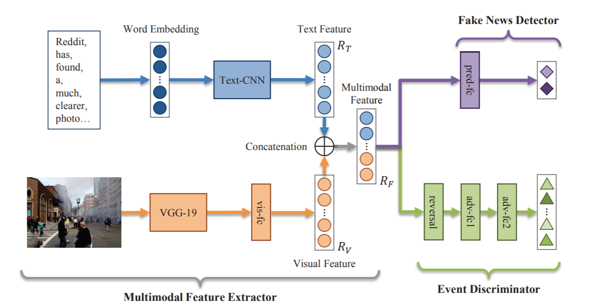

EANN
=====
Introduction
-------------
`[paper] <https://dl.acm.org/doi/abs/10.1145/3219819.3219903>`_

**Title:** EANN: Event Adversarial Neural Networks for Multi-Modal Fake News Detection

**Authors:** Yaqing Wang, Fenglong Ma, Zhiwei Jin, Ye Yuan, Guangxu Xun, Kishlay Jha, Lu Su, Jing Gao

**Abstract:** As news reading on social media becomes more and more popular, fake news becomes a major issue concerning
the public and government. The fake news can take advantage of multimedia content to mislead readers and get dissemination,
which can cause negative effects or even manipulate the public events. One of the unique challenges for fake news detection
on social media is how to identify fake news on newly emerged events. Unfortunately, most of the existing approaches can
hardly handle this challenge, since they tend to learn event-specific features that can not be transferred to unseen events.
In order to address this issue, we propose an end-to-end framework named Event Adversarial Neural Network (EANN), which
can derive event-invariant features and thus benefit the detection of fake news on newly arrived events. It consists of
three main components: the multi-modal feature extractor, the fake news detector, and the event discriminator. The multi-modal
feature extractor is responsible for extracting the textual and visual features from posts. It cooperates with the fake
news detector to learn the discriminable representation for the detection of fake news. The role of event discriminator
is to remove the event-specific features and keep shared features among events. Extensive experiments are conducted on
multimedia datasets collected from Weibo and Twitter. The experimental results show our proposed EANN model can outperform
the state-of-the-art methods, and learn transferable feature representations.

For source code, please refer to :ref:`EANN <faknow.model.content_based.multi_modal.eann>`

If you want to change parameters, dataset or evaluation settings, take a look at

- :doc:`../../../../user_guide/config_intro`
- :doc:`../../../../user_guide/data_intro`
- :doc:`../../../../user_guide/train_eval_intro`
- :doc:`../../../../user_guide/usage`
