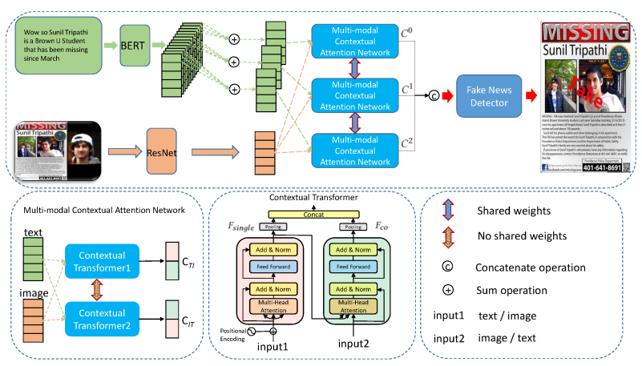

HMCAN
=====
Introduction
-------------
`[paper] <https://dl.acm.org/doi/10.1145/3404835.3462871>`_

**Title:** Hierarchical Multi-modal Contextual Attention Network for Fake News Detection

**Authors:** Shengsheng Qian, Jinguang Wang, Jun Hu, Quan Fang, Changsheng Xu

**Abstract:** Nowadays, detecting fake news on social media platforms has become a top priority since the widespread
dissemination of fake news may mislead readers and have negative effects. To date, many algorithms have been proposed to
facilitate the detection of fake news from the hand-crafted feature extraction methods to deep learning approaches.
However, these methods may suffer from the following limitations: (1) fail to utilize the multi-modal context information
and extract high-order complementary information for each news to enhance the detection of fake news; (2) largely ignore
the full hierarchical semantics of textual content to assist in learning a better news representation. To overcome these
limitations, this paper proposes a novel hierarchical multi-modal contextual attention network (HMCAN) for fake news
detection by jointly modeling the multi-modal context information and the hierarchical semantics of text in a unified
deep model. Specifically, we employ BERT and ResNet to learn better representations for text and images, respectively.
Then, we feed the obtained representations of images and text into a multi-modal contextual attention network to fuse
both inter-modality and intra-modality relationships. Finally, we design a hierarchical encoding network to capture the
rich hierarchical semantics for fake news detection. Extensive experiments on three public real datasets demonstrate
that our proposed HMCAN achieves state-of-the-art performance.

For source code, please refer to :ref:`HMCAN <faknow.model.content\_based.multi\_modal.hmcan>`

If you want to change parameters, dataset or evaluation settings, take a look at

- :doc:`../../../../user_guide/config_intro`
- :doc:`../../../../user_guide/data_intro`
- :doc:`../../../../user_guide/train_eval_intro`
- :doc:`../../../../user_guide/usage`