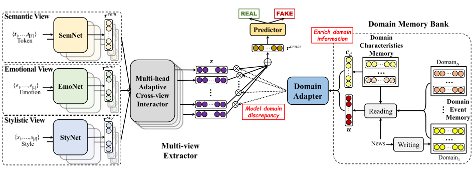

M3FEND
=====
Introduction
-------------
`[paper] <https://ieeexplore.ieee.org/document/9802916>`_

**Title:** Memory-Guided Multi-View Multi-Domain Fake News Detection

**Authors:** Yongchun Zhu; Qiang Sheng; Juan Cao; Qiong Nan; Kai Shu; Minghui Wu; Jindong Wang; Fuzhen Zhuang

**Abstract:** The wide spread of fake news is increasingly threatening both individuals and society. Great efforts have
been made for automatic fake news detection on a single domain (e.g., politics). However, correlations exist commonly
across multiple news domains, and thus it is promising to simultaneously detect fake news of multiple domains. Based on
our analysis, we pose two challenges in multi-domain fake news detection: 1) domain shift , caused by the discrepancy
among domains in terms of words, emotions, styles, etc. 2) domain labeling incompleteness , stemming from the real-world
categorization that only outputs one single domain label, regardless of topic diversity of a news piece. In this paper,
we propose a Memory-guided Multi-view Multi-domain Fake News Detection Framework (M 3 FEND) to address these two challenges.
We model news pieces from a multi-view perspective, including semantics, emotion, and style. Specifically, we propose a
Domain Memory Bank to enrich domain information which could discover potential domain labels based on seen news pieces
and model domain characteristics. Then, with enriched domain information as input, a Domain Adapter could adaptively
aggregate discriminative information from multiple views for news in various domains. Extensive offline experiments on
English and Chinese datasets demonstrate the effectiveness of M 3 FEND, and online tests verify its superiority in practice.
Our code is available at https://github.com/ICTMCG/M3FEND .

For source code, please refer to :ref:`M3FEND <faknow.model.content_based.m3fend>`

If you want to change parameters, dataset or evaluation settings, take a look at

- :doc:`../../../../user_guide/config_intro`
- :doc:`../../../../user_guide/data_intro`
- :doc:`../../../../user_guide/train_eval_intro`
- :doc:`../../../../user_guide/usage`