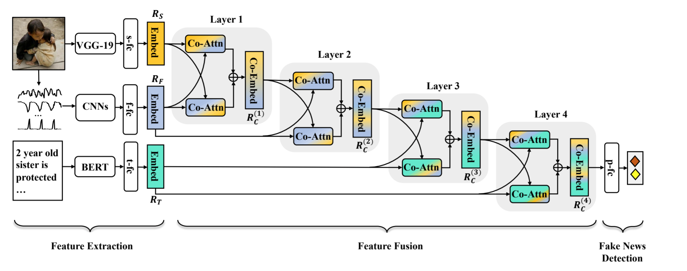

MCAN
====
Introduction
-------------
`[paper] <https://aclanthology.org/2021.findings-acl.226/>`_

**Title:** Multimodal Fusion with Co-Attention Networks for Fake News Detection

**Authors:** Yang Wu, Pengwei Zhan, Yunjian Zhang, Liming Wang, Zhen Xu

**Abstract:** Fake news with textual and visual contents has a better story-telling ability than text-only contents, and
can be spread quickly with social media. People can be easily deceived by such fake news, and traditional expert identification
is labor-intensive. Therefore, automatic detection of multimodal fake news has become a new hot-spot issue. A shortcoming
of existing approaches is their inability to fuse multimodality features effectively. They simply concatenate unimodal
features without considering inter-modality relations. Inspired by the way people read news with image and text, we propose
a novel Multimodal Co-Attention Networks (MCAN) to better fuse textual and visual features for fake news detection.
Extensive experiments conducted on two realworld datasets demonstrate that MCAN can learn inter-dependencies among multimodal
features and outperforms state-of-the-art methods.

For source code, please refer to :ref:`MCAN <faknow.model.content\_based.multi\_modal.mcan>`

If you want to change parameters, dataset or evaluation settings, take a look at

- :doc:`../../../../user_guide/config_intro`
- :doc:`../../../../user_guide/data_intro`
- :doc:`../../../../user_guide/train_eval_intro`
- :doc:`../../../../user_guide/usage`