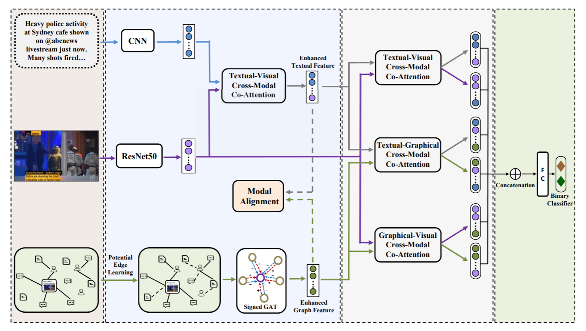

MFAN
====
Introduction
-------------
`[paper] <https://www.ijcai.org/proceedings/2022/335>`_

**Title:** MFAN: Multi-modal Feature-enhanced Attention Networks for Rumor Detection

**Authors:** Jiaqi Zheng, Xi Zhang, Sanchuan Guo, Quan Wang, Wenyu Zang, Yongdong Zhang

**Abstract:** Rumor spreaders are increasingly taking advantage of multimedia content to attract and mislead news consumers
on social media. Although recent multimedia rumor detection models have exploited both textual and visual features for
classification, they do not integrate the social structure features simultaneously, which have shown promising performance
for rumor identification. It is challenging to combine the heterogeneous multi-modal data in consideration of their complex
relationships. In this work, we propose a novel Multi-modal Feature-enhanced Attention Networks (MFAN) for rumor detection,
which makes the first attempt to integrate textual, visual, and social graph features in one unified framework. Specifically,
it considers both the complement and alignment relationships between different modalities to achieve better fusion. Moreover,
it takes into account the incomplete links in the social network data due to data collection constraints and proposes to
infer hidden links to learn better social graph features. The experimental results show that MFAN can detect rumors effectively
and outperform state-of-the-art methods.

For source code, please refer to :ref:`MFAN <faknow.model.content_based.multi_modal.mfan>`

If you want to change parameters, dataset or evaluation settings, take a look at

- :doc:`../../../../user_guide/config_intro`
- :doc:`../../../../user_guide/data_intro`
- :doc:`../../../../user_guide/train_eval_intro`
- :doc:`../../../../user_guide/usage`