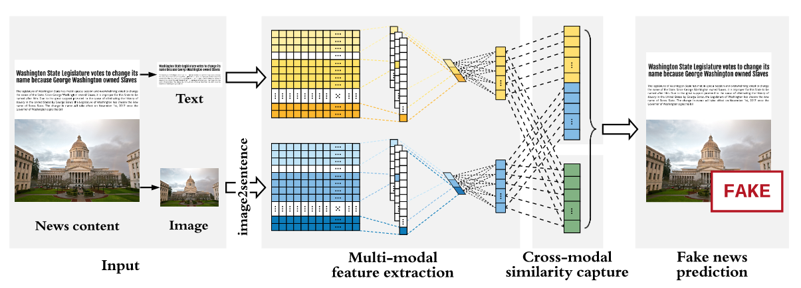

SAFE
====
Introduction
-------------
`[paper] <https://dl.acm.org/doi/abs/10.1007/978-3-030-47436-2_27>`_

**Title:** SAFE: Similarity-Aware Multi-Modal Fake News Detection

**Authors:** Xinyi Zhou, Jindi Wu, Reza Zafarani

**Abstract:** Effective detection of fake news has recently attracted significant attention. Current studies have made
significant contributions to predicting fake news with less focus on exploiting the relationship (similarity) between
the textual and visual information in news articles. Attaching importance to such similarity helps identify fake news
stories that, for example, attempt to use irrelevant images to attract readers’ attention. In this work, we propose a
imilarity-ware ak news detection method () which investigates multi-modal (textual and visual) information of news
articles. First, neural networks are adopted to separately extract textual and visual features for news representation.
We further investigate the relationship between the extracted features across modalities. Such representations of news
textual and visual information along with their relationship are jointly learned and used to predict fake news.
The proposed method facilitates recognizing the falsity of news articles based on their text, images, or their “mismatches.”
We conduct extensive experiments on large-scale real-world data, which demonstrate the effectiveness of the proposed method.

Running with Faknow
---------------------
**Model Hyper-Parameters:**

- ``embedding_size (int, optional)`` : Size of the embedding for SAFE model. Defaults to ``300``.

- ``conv_in_size (int, optional)`` : Size of the input for convolutional layer. Defaults to ``32``.

- ``filter_num (int, optional)`` : Number of filters for convolutional layer. Defaults to ``128``.

- ``cnn_out_size (int, optional)`` : Size of the output for the convolutional layer. Defaults to ``200``.

- ``dropout (float, optional)`` : Dropout probability. Defaults to ``0.0``.

- ``loss_weights (List[float], optional)`` : List of loss weights. Defaults to ``None``.

- ``batch_size (int, optional)`` : Batch size. Defaults to ``64``.

- ``lr (float, optional)`` : Learning rate. Defaults to ``0.00025``.

- ``metrics (List, optional)`` : List of evaluation metrics. Defaults to ``None``.

- ``num_epochs (int, optional)`` : Number of training epochs. Defaults to ``100``.

- ``device (str, optional)`` : Device to run the training on ('cpu' or 'cuda'). Defaults to 'cpu'.

**A Running Example:**

Write the following code to a python file, such as run.py

.. code:: python

    from faknow.run.content_based.multimodal import run_safe

    run_safe(train_path=, validate_path=, test_path=)

And then:

.. code:: bash

   python run.py

If you want to change parameters, dataset or evaluation settings, take a look at

- :doc:`../../../../user_guide/config_intro`
- :doc:`../../../../user_guide/data_intro`
- :doc:`../../../../user_guide/train_eval_intro`
- :doc:`../../../../user_guide/usage`
