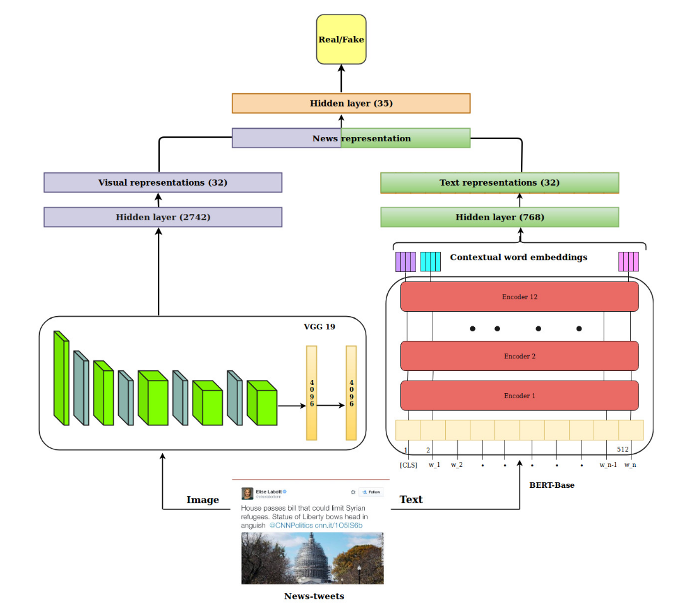

SpotFake
========
Introduction
-------------
`[paper] <https://ieeexplore.ieee.org/document/8919302>`_

**Title:** SpotFake: A Multi-modal Framework for Fake News Detection

**Authors:** Shivangi Singhal, Rajiv Ratn Shah, Tanmoy Chakraborty, Ponnurangam Kumaraguru, Shin'ichi Satoh

**Abstract:** A rapid growth in the amount of fake news on social media is a very serious concern in our society. It is
usually created by manipulating images, text, audio, and videos. This indicates that there is a need of multimodal system
for fake news detection. Though, there are multimodal fake news detection systems but they tend to solve the problem of
fake news by considering an additional sub-task like event discriminator and finding correlations across the modalities.
The results of fake news detection are heavily dependent on the subtask and in absence of subtask training, the performance
of fake news detection degrade by 10% on an average. To solve this issue, we introduce SpotFake-a multi-modal framework
for fake news detection. Our proposed solution detects fake news without taking into account any other subtasks.
It exploits both the textual and visual features of an article. Specifically, we made use of language models (like BERT)
to learn text features, and image features are learned from VGG-19 pre-trained on ImageNet dataset. All the experiments
are performed on two publicly available datasets, i.e., Twitter and Weibo. The proposed model performs better than the
current state-of-the-art on Twitter and Weibo datasets by 3.27% and 6.83%, respectively.

Running with Faknow
---------------------
**Model Hyper-Parameters:**

- ``text_fc2_out (int, optional) ``: Output size for the text FC2 layer. Defaults to ``32``.

- ``text_fc1_out (int, optional) ``: Output size for the text FC1 layer. Defaults to ``2742``.

- ``dropout_p (float, optional)`` : Dropout probability. Defaults to ``0.4``.

- ``fine_t  une_text_module (bool, optional)`` : Fine-tune text module. Defaults to ``False``.

- ``img_fc1_out (int, optional)`` : Output size for the image FC1 layer. Defaults to ``2742``.

- ``img_fc2_out (int, optional)`` : Output size for the image FC2 layer. Defaults to ``32``.

- ``fine_tune_vis_module (bool, optional)`` : Fine-tune visual module. Defaults to ``False``.

- ``fusion_output_size (int, optional)`` : Output size for the fusion layer. Defaults to ``35``.

- ``loss_func (nn.Module, optional)`` : Loss function. Defaults to ``nn.BCELoss()``.

- ``pre_trained_bert_name (str, optional)` : Name of the pre-trained BERT model. Defaults to ``"bert-base-uncased"``.

- ``batch_size (int, optional)`` : Batch size. Defaults to ``8``.

- ``epochs (int, optional)`` : Number of training epochs. Defaults to ``50``.

- ``max_len (int, optional)`` : Maximum length for tokenization. Defaults to ``500``.

- ``lr (float, optional)`` : Learning rate. Defaults to ``3e-5``.

- ``metrics (List, optional)`` : List of evaluation metrics. Defaults to ``None``.

- ``device (str, optional)`` : Device to run the training on ('cpu' or 'cuda'). Defaults to ``'cuda:0'``.

**A Running Example:**

Write the following code to a python file, such as run.py

.. code:: python

    from faknow.run.content_based.multimodal import run_spotfake

    run_spotfake(train_path=, validate_path=, test_path=)

And then:

.. code:: bash

   python run.py

If you want to change parameters, dataset or evaluation settings, take a look at

- :doc:`../../../../user_guide/config_intro`
- :doc:`../../../../user_guide/data_intro`
- :doc:`../../../../user_guide/train_eval_intro`
- :doc:`../../../../user_guide/usage`