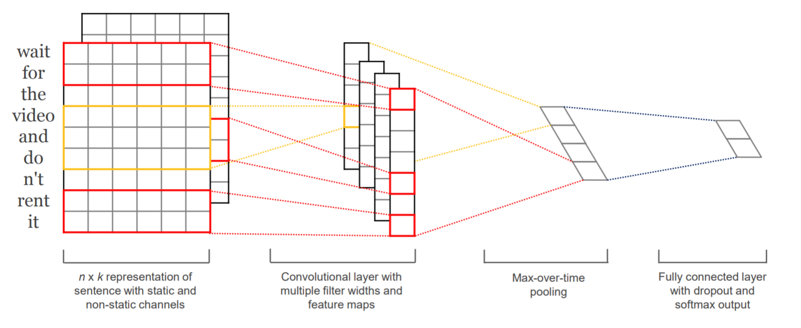

TEXTCNN
=======
Introduction
-------------
`[paper] <https://aclanthology.org/D14-1181/>`_

**Title:** Convolutional Neural Networks for Sentence Classification

**Authors:** Yoon Kim

**Abstract:** We report on a series of experiments with convolutional neural networks (CNN) trained on top of pre-trained
word vectors for sentence-level classification tasks. We show that a simple CNN with little hyperparameter tuning and static
vectors achieves excellent results on multiple benchmarks. Learning task-specific vectors through fine-tuning offers further
gains in performance. We additionally propose a simple modification to the architecture to allow for the use of both
task-specific and static vectors. The CNN models discussed herein improve upon the state of the art on 4 out of 7 tasks,
which include sentiment analysis and question classification.

Running with Faknow
---------------------
**Model Hyper-Parameters:**

- ``vocab (Dict[str, int])`` : vocabulary of the corpus

- ``stop_words (List[str])`` : stop words

- ``word_vectors (torch.Tensor)`` : word vectors

- ``language (str)`` : language of the corpus, 'zh' or 'en', default = ``'zh'``

- ``max_len (int)`` : max length of the text, default = ``255``

- ``filter_num (int)`` : number of filters, default = ``100``

- ``kernel_sizes (List[int])`` : list of different kernel_num sizes for TextCNNLayer, if None, [3, 4, 5] is taken as default, default = ``None``

- ``activate_func (Callable)`` : activate function for TextCNNLayer, default = ``relu``

- ``dropout (float)`` : drop out rate of fully connected layer, default = ``0.5``

- ``freeze (bool)`` : whether to freeze weights in word embedding layer while training,default = ``False``

- ``batch_size (int)`` : batch size, default = ``100``

- ``lr (float)`` : learning rate, default = ``0.001``

- ``num_epochs (int)`` : number of epochs, default = ``100``

- ``metrics (List)`` : metrics, if None, ['accuracy', 'precision', 'recall', 'f1'] is used, default = ``None``

- ``device (str)`` : device, default = ``'cpu'``

**A Running Example:**

Write the following code to a python file, such as run.py

.. code:: python

    from faknow.run.content_based.multimodal import run_textcnn

    run_textcnn(train_path=, validate_path=, test_path=)

And then:

.. code:: bash

   python run.py

If you want to change parameters, dataset or evaluation settings, take a look at

- :doc:`../../../../user_guide/config_intro`
- :doc:`../../../../user_guide/data_intro`
- :doc:`../../../../user_guide/train_eval_intro`
- :doc:`../../../../user_guide/usage`