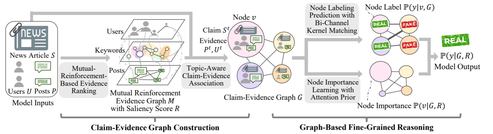

FinerFact
==========
Introduction
-------------
`[paper] <https://aaai.org/papers/05746-towards-fine-grained-reasoning-for-fake-news-detection/>`_

**Title:** Towards Fine-Grained Reasoning for Fake News Detection

**Authors:** Yiqiao Jin1, Xiting Wang, Ruichao Yang, Yizhou Sun, Wei Wang, Hao Liao, Xing Xie

**Abstract:** The detection of fake news often requires sophisticated reasoning skills, such as logically combining
information by considering word-level subtle clues. In this paper, we move towards fine-grained reasoning for fake news
detection by better reflecting the logical processes of human thinking and enabling the modeling of subtle clues. In
particular, we propose a fine-grained reasoning framework by following the human’s information-processing model, introduce
a mutual-reinforcement-based method for incorporating human knowledge about which evidence is more important, and design
a prior-aware bi-channel kernel graph network to model subtle differences between pieces of evidence. Extensive experiments
show that our model outperforms the state-of-the-art methods and demonstrate the explainability of our approach.

Running with Faknow
---------------------
**Model Hyper-Parameters:**

- ``bert (str)`` : bert model, default = ``'bert-base-uncased'``

- ``lr (float)`` : learning rate, default = ``5e-5``

- ``batch_size (int)`` : batch size, default = ``8``

- ``num_epochs (int)`` : number of epochs, default = ``20``

- ``gradient_accumulation_steps (int)`` : gradient accumulation steps, default = ``8``

- ``warmup_ratio (float)`` : warmup ratio, default = ``0.6``

- ``metrics (List)`` : metrics for evaluation, if None, ['accuracy', 'precision', 'recall', 'f1'] is used, default = ``None``

- ``device (str)`` : device, default = ``cpu'``

**A Running Example:**

Write the following code to a python file, such as run.py

.. code:: python

    from faknow.run.knowledge_aware import run_finerfact

    run_finerfact(train_data=)

And then:

.. code:: bash

   python run.py

If you want to change parameters, dataset or evaluation settings, take a look at

- :doc:`../../../../user_guide/config_intro`
- :doc:`../../../../user_guide/data_intro`
- :doc:`../../../../user_guide/train_eval_intro`
- :doc:`../../../../user_guide/usage`