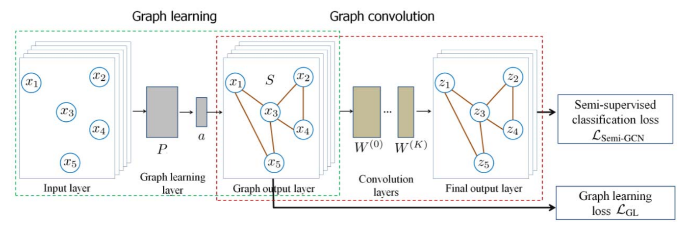

BASE_GNN
========
Introduction
-------------
`[paper] <https://ieeexplore.ieee.org/document/8953909>`_

**Title:** Semi-Supervised Learning With Graph Learning-Convolutional Networks

**Authors:** Bo Jiang, Ziyan Zhang, Doudou Lin, Jin Tang, Bin Luo

**Abstract:** Graph Convolutional Neural Networks (graph CNNs) have been widely used for graph data representation and
semi-supervised learning tasks. However, existing graph CNNs generally use a fixed graph which may not be optimal for
semi-supervised learning tasks. In this paper, we propose a novel Graph Learning-Convolutional Network (GLCN) for graph
data representation and semi-supervised learning. The aim of GLCN is to learn an optimal graph structure that best serves
graph CNNs for semi-supervised learning by integrating both graph learning and graph convolution in a unified network
architecture. The main advantage is that in GLCN both given labels and the estimated labels are incorporated and thus can
provide useful `weakly' supervised information to refine (or learn) the graph construction and also to facilitate the
graph convolution operation for unknown label estimation. Experimental results on seven benchmarks demonstrate that GLCN
significantly outperforms the state-of-the-art traditional fixed structure based graph CNNs.

If you want to change parameters, dataset or evaluation settings, take a look at

- :doc:`../../../../user_guide/config_intro`
- :doc:`../../../../user_guide/data_intro`
- :doc:`../../../../user_guide/train_eval_intro`
- :doc:`../../../../user_guide/usage`

