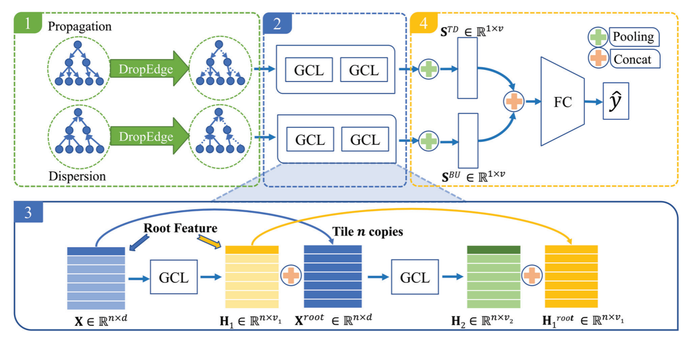

BIGCN
=====
Introduction
-------------
`[paper] <https://ojs.aaai.org/index.php/AAAI/article/view/5393>`_

**Title:** Rumor Detection on Social Media with Bi-Directional Graph Convolutional Networks

**Authors:** Tian Bian, Xi Xiao, Tingyang Xu, Peilin Zhao, Wenbing Huang, Yu Rong, Junzhou Huang

**Abstract:**

Running with Faknow
---------------------
**Model Hyper-Parameters:**

- ``name (str)`` : The name of the graph set (:obj:`"politifact"`, :obj:`"gossipcop"`)

- ``feature (str)`` : The node feature type (:obj:`"profile"`, :obj:`"spacy"`, :obj:`"bert"`, :obj:`"content"`)
        If set to :obj:`"profile"`, the 10-dimensional node feature
        is composed of ten Twitter user profile attributes.
        If set to :obj:`"spacy"`, the 300-dimensional node feature is
        composed of Twitter user historical tweets encoded by
        the `spaCy word2vec encoder
        <https://spacy.io/models/en#en_core_web_lg>`_.
        If set to :obj:`"bert"`, the 768-dimensional node feature is
        composed of Twitter user historical tweets encoded by the
        `bert-as-service <https://github.com/hanxiao/bert-as-service>`_.
        If set to :obj:`"content"`, the 310-dimensional node feature is
        composed of a 300-dimensional "spacy" vector plus a
        10-dimensional "profile" vector.

- ``splits (List[str])`` : dataset split, including 'train', 'val' and 'test'.
        If None, ['train', 'val', 'test'] will be used. Default = ``None``

- ``batch_size (int)`` : batch size, default = ``128``

- ``epochs (int)`` : number of epochs, default = ``45``

- ``hidden_size (int)`` : dimension of hidden layer, default = ``128``

- ``td_drop_rate (float)`` : drop rate of drop edge in top-down direction, default = ``0.2``

- ``bu_drop_rate (float)`` : drop rate of drop edge in bottom-up direction, default = ``0.2``

- ``lr (float)`` : learning rate, default = ``0.01``

- ``weight_decay (float)`` : weight decay, default = ``0.001``

- ``metrics (List)`` : evaluation metrics, if None, ['accuracy', 'precision', 'recall', 'f1'] is used, default = ``None``

- ``device (str)`` : device, default = ``'cpu'``

**A Running Example:**

Write the following code to a python file, such as run.py

.. code:: python

    from faknow.run.social_context import run_bigcn

    run_bigcn(root=, name=, feature=)

And then:

.. code:: bash

   python run.py

If you want to change parameters, dataset or evaluation settings, take a look at

- :doc:`../../../../user_guide/config_intro`
- :doc:`../../../../user_guide/data_intro`
- :doc:`../../../../user_guide/train_eval_intro`
- :doc:`../../../../user_guide/usage`
