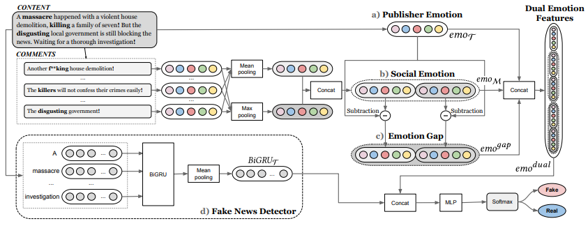

DUDEF
=====
Introduction
-------------
`[paper] <https://dl.acm.org/doi/10.1145/3442381.3450004>`_

**Title:** Mining Dual Emotion for Fake News Detection

**Authors:** Xueyao Zhang, Juan Cao, Xirong Li, Qiang Sheng, Lei Zhong, Kai Shu

**Abstract:** Emotion plays an important role in detecting fake news online. When leveraging emotional signals, the existing
methods focus on exploiting the emotions of news contents that conveyed by the publishers (i.e., publisher emotion). However,
fake news often evokes high-arousal or activating emotions of people, so the emotions of news comments aroused in the crowd
(i.e., social emotion) should not be ignored. Furthermore, it remains to be explored whether there exists a relationship
between publisher emotion and social emotion (i.e., dual emotion), and how the dual emotion appears in fake news. In this
paper, we verify that dual emotion is distinctive between fake and real news and propose Dual Emotion Features to represent
dual emotion and the relationship between them for fake news detection. Further, we exhibit that our proposed features
can be easily plugged into existing fake news detectors as an enhancement. Extensive experiments on three real-world datasets
(one in English and the others in Chinese) show that our proposed feature set: 1) outperforms the state-of-the-art task-related
emotional features; 2) can be well compatible with existing fake news detectors and effectively improve the performance
of detecting fake news.

For source code, please refer to :ref:`DUDEF <faknow.model.social_context.dudef>`

If you want to change parameters, dataset or evaluation settings, take a look at

- :doc:`../../../../user_guide/config_intro`
- :doc:`../../../../user_guide/data_intro`
- :doc:`../../../../user_guide/train_eval_intro`
- :doc:`../../../../user_guide/usage`