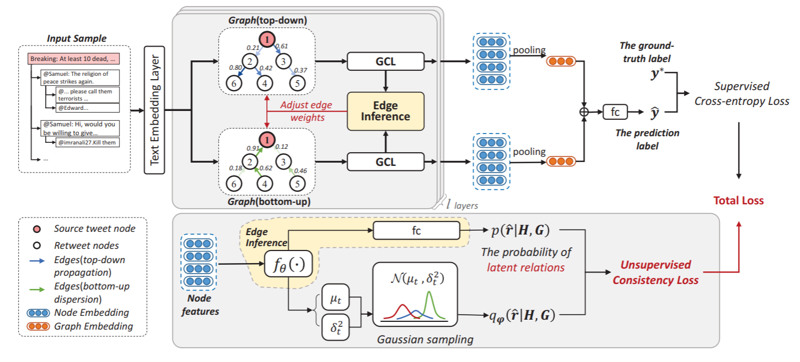

EBGCN
=====
Introduction
-------------
`[paper] <https://aclanthology.org/2021.acl-long.297/>`_

**Title:** Towards Propagation Uncertainty: Edge-enhanced Bayesian Graph Convolutional Networks for Rumor Detection

**Authors:** Lingwei Wei, Dou Hu, Wei Zhou, Zhaojuan Yue, Songlin Hu

**Abstract:** Detecting rumors on social media is a very critical task with significant implications to the economy,
public health, etc. Previous works generally capture effective features from texts and the propagation structure. However,
the uncertainty caused by unreliable relations in the propagation structure is common and inevitable due to wily rumor
producers and the limited collection of spread data. Most approaches neglect it and may seriously limit the learning of
features. Towards this issue, this paper makes the first attempt to explore propagation uncertainty for rumor detection.
Specifically, we propose a novel Edge-enhanced Bayesian Graph Convolutional Network (EBGCN) to capture robust structural
features. The model adaptively rethinks the reliability of latent relations by adopting a Bayesian approach. Besides, we
design a new edge-wise consistency training framework to optimize the model by enforcing consistency on relations.
Experiments on three public benchmark datasets demonstrate that the proposed model achieves better performance than baseline
methods on both rumor detection and early rumor detection tasks.

For source code, please refer to :ref:`EBGCN <faknow.model.social_context.ebgcn>`

If you want to change parameters, dataset or evaluation settings, take a look at

- :doc:`../../../../user_guide/config_intro`
- :doc:`../../../../user_guide/data_intro`
- :doc:`../../../../user_guide/train_eval_intro`
- :doc:`../../../../user_guide/usage`