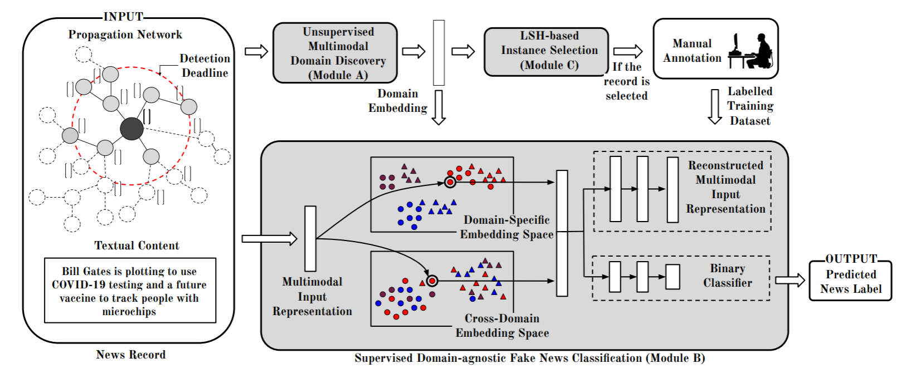

EDDFN
=====
Introduction
-------------
`[paper] <https://ojs.aaai.org/index.php/AAAI/article/view/16134>`_

**Title:** Embracing Domain Differences in Fake News: Cross-domain Fake News Detection using Multi-modal Data

**Authors:** Amila Silva， Ling Luo， Shanika Karunasekera， Christopher Leckie

**Abstract:** With the rapid evolution of social media, fake news has become a significant social problem, which cannot
be addressed in a timely manner using manual investigation. This has motivated numerous studies on automating fake news
detection. Most studies explore supervised training models with different modalities (e.g., text, images, and propagation
networks) of news records to identify fake news. However, the performance of such techniques generally drops if news records
are coming from different domains (e.g., politics, entertainment), especially for domains that are unseen or rarely-seen
during training. As motivation, we empirically show that news records from different domains have significantly different
word usage and propagation patterns. Furthermore, due to the sheer volume of unlabelled news records, it is challenging
to select news records for manual labelling so that the domain-coverage of the labelled dataset is maximised. Hence, this
work: (1) proposes a novel framework that jointly preserves domain-specific and cross-domain knowledge in news records
to detect fake news from different domains; and (2) introduces an unsupervised technique to select a set of unlabelled
informative news records for manual labelling, which can be ultimately used to train a fake news detection model that
performs well for many domains while minimizing the labelling cost. Our experiments show that the integration of the proposed
fake news model and the selective annotation approach achieves state-of-the-art performance for cross-domain news datasets,
while yielding notable improvements for rarely-appearing domains in news datasets.

Running with Faknow
---------------------
**Model Hyper-Parameters:**

- ``train_pool_input (Tensor)`` : train pool input, shape=(train_pool_size, input_size)

- ``train_pool_label (Tensor)`` : train pool label, shape=(train_pool_size, )

- ``domain_embedding (Tensor)`` : domain embedding, shape=(train_pool_size, domain_size)

- ``budget_size (float)`` : budget size, default = ``0.8``

- ``num_h (int)`` : number of hash functions, default = ``10``

- ``batch_size (int)`` : batch size, default = ``32``

- ``num_epochs (int)`` : number of epochs, default = ``100``

- ``lr (float)`` : learning rate, default = ``0.02``

- ``metrics (List)``  : evaluation metrics, if None, use default metrics, default = ``None``

- ``device (str)`` : device, default = ``'cpu'``

**A Running Example:**

Write the following code to a python file, such as run.py

.. code:: python

    from faknow.run.social_context import run_eddfn

    run_eddfn(train_pool_input=, train_pool_label=, domain_embedding=)

And then:

.. code:: bash

   python run.py

If you want to change parameters, dataset or evaluation settings, take a look at

- :doc:`../../../../user_guide/config_intro`
- :doc:`../../../../user_guide/data_intro`
- :doc:`../../../../user_guide/train_eval_intro`
- :doc:`../../../../user_guide/usage`
