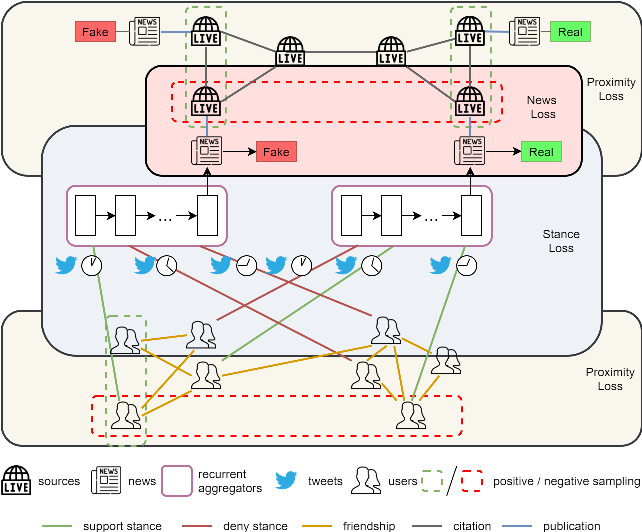

FANG
=====
Introduction
-------------
`[paper] <https://dl.acm.org/doi/10.1145/3340531.3412046>`_

**Title:** FANG: Leveraging Social Context for Fake News Detection Using Graph Representation

**Authors:** Van-Hoang Nguye, Kazunari Sugiyama, Preslav Nakov, Min-Yen Kan

**Abstract:** We propose Factual News Graph (FANG), a novel graphical social context representation and learning
framework for fake news detection. Unlike previous contextual models that have targeted performance, our focus is on
representation learning. Compared to transductive models, FANG is scalable in training as it does not have to maintain
all nodes, and it is efficient at inference time, without the need to re-process the entire graph. Our experimental
results show that FANG is better at capturing the social context into a high fidelity representation, compared to recent
graphical and non-graphical models. In particular, FANG yields significant improvements for the task of fake news detection,
and it is robust in the case of limited training data. We further demonstrate that the representations learned by FANG
generalize to related tasks, such as predicting the factuality of reporting of a news medium.

For source code, please refer to :ref:`FANG <faknow.model.social_context.fang>`

If you want to change parameters, dataset or evaluation settings, take a look at

- :doc:`../../../../user_guide/config_intro`
- :doc:`../../../../user_guide/data_intro`
- :doc:`../../../../user_guide/train_eval_intro`
- :doc:`../../../../user_guide/usage`