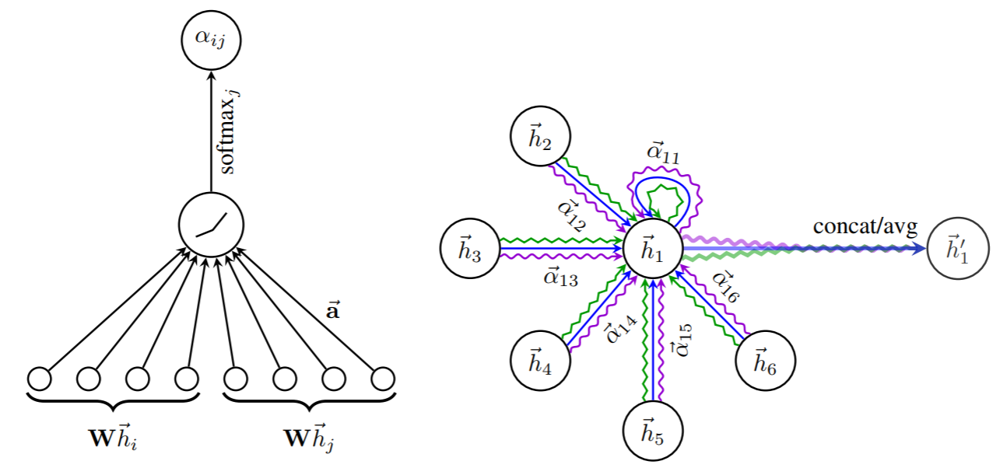

GAT
========
Introduction
-------------
`[paper] <https://openreview.net/forum?id=rJXMpikCZ>`_

**Title:** Graph Attention Networks

**Authors:** Petar Veličković, Guillem Cucurull, Arantxa Casanova, Adriana Romero, Pietro Liò, Yoshua Bengio

**Abstract:** We present graph attention networks (GATs), novel neural network architectures that operate on graph-structured data,
leveraging masked self-attentional layers to address the shortcomings of prior methods based on graph convolutions or
their approximations. By stacking layers in which nodes are able to attend over their neighborhoods' features, we enable
(implicitly) specifying different weights to different nodes in a neighborhood, without requiring any kind of computationally
intensive matrix operation (such as inversion) or depending on knowing the graph structure upfront. In this way, we address
several key challenges of spectral-based graph neural networks simultaneously, and make our model readily applicable to
inductive as well as transductive problems. Our GAT models have achieved or matched state-of-the-art results across four
established transductive and inductive graph benchmarks: the Cora, Citeseer and Pubmed citation network datasets, as well
as a protein-protein interaction dataset (wherein test graphs remain unseen during training).

For source code, please refer to :ref:`BASE_GNN <faknow.model.social_context.base_gnn>`

If you want to change parameters, dataset or evaluation settings, take a look at

- :doc:`../../../../user_guide/config_intro`
- :doc:`../../../../user_guide/data_intro`
- :doc:`../../../../user_guide/train_eval_intro`
- :doc:`../../../../user_guide/usage`