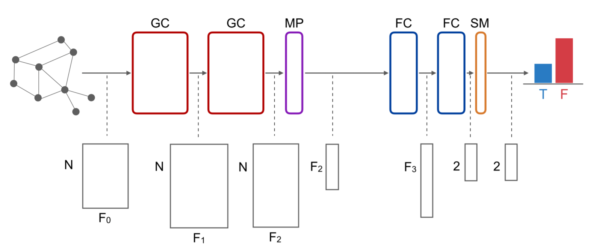

GCNFN
=====
Introduction
-------------
`[paper] <https://arxiv.org/abs/1902.06673>`_

**Title:** Fake News Detection on Social Media using Geometric Deep Learning

**Authors:** Federico Monti, Fabrizio Frasca, Davide Eynard, Damon Mannion, Michael M. Bronstein

**Abstract:** Social media are nowadays one of the main news sources for millions of people around the globe due to their
low cost, easy access and rapid dissemination. This however comes at the cost of dubious trustworthiness and significant
risk of exposure to 'fake news', intentionally written to mislead the readers. Automatically detecting fake news poses
challenges that defy existing content-based analysis approaches. One of the main reasons is that often the interpretation
of the news requires the knowledge of political or social context or 'common sense', which current NLP algorithms are still
missing. Recent studies have shown that fake and real news spread differently on social media, forming propagation patterns
that could be harnessed for the automatic fake news detection. Propagation-based approaches have multiple advantages compared
to their content-based counterparts, among which is language independence and better resilience to adversarial attacks.
In this paper we show a novel automatic fake news detection model based on geometric deep learning. The underlying core
algorithms are a generalization of classical CNNs to graphs, allowing the fusion of heterogeneous data such as content,
user profile and activity, social graph, and news propagation. Our model was trained and tested on news stories, verified
by professional fact-checking organizations, that were spread on Twitter. Our experiments indicate that social network
structure and propagation are important features allowing highly accurate (92.7% ROC AUC) fake news detection. Second,
we observe that fake news can be reliably detected at an early stage, after just a few hours of propagation. Third, we
test the aging of our model on training and testing data separated in time. Our results point to the promise of
propagation-based approaches for fake news detection as an alternative or complementary strategy to content-based approaches.

For source code, please refer to :ref:`GCNFN <faknow.model.social_context.gcnfn>`

If you want to change parameters, dataset or evaluation settings, take a look at

- :doc:`../../../../user_guide/config_intro`
- :doc:`../../../../user_guide/data_intro`
- :doc:`../../../../user_guide/train_eval_intro`
- :doc:`../../../../user_guide/usage`