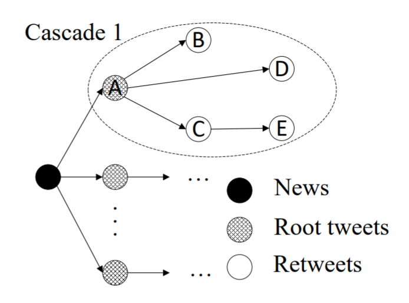

GNNCL
=====
Introduction
-------------
`[paper] <https://arxiv.org/abs/2007.03316>`_

**Title:** Graph Neural Networks with Continual Learning for Fake News Detection from Social Media

**Authors:** Yi Han, Shanika Karunasekera, Christopher Leckie

**Abstract:** Although significant effort has been applied to fact-checking, the prevalence of fake news over social media,
which has profound impact on justice, public trust and our society, remains a serious problem. In this work, we focus on
propagation-based fake news detection, as recent studies have demonstrated that fake news and real news spread differently
online. Specifically, considering the capability of graph neural networks (GNNs) in dealing with non-Euclidean data, we
use GNNs to differentiate between the propagation patterns of fake and real news on social media. In particular, we
concentrate on two questions: (1) Without relying on any text information, e.g., tweet content, replies and user
descriptions, how accurately can GNNs identify fake news? Machine learning models are known to be vulnerable to adversarial
attacks, and avoiding the dependence on text-based features can make the model less susceptible to the manipulation of
advanced fake news fabricators. (2) How to deal with new, unseen data? In other words, how does a GNN trained on a given
dataset perform on a new and potentially vastly different dataset? If it achieves unsatisfactory performance, how do we
solve the problem without re-training the model on the entire data from scratch? We study the above questions on two
datasets with thousands of labelled news items, and our results show that: (1) GNNs can achieve comparable or superior
performance without any text information to state-of-the-art methods. (2) GNNs trained on a given dataset may perform
poorly on new, unseen data, and direct incremental training cannot solve the problem---this issue has not been addressed
in the previous work that applies GNNs for fake news detection. In order to solve the problem, we propose a method that
achieves balanced performance on both existing and new datasets, by using techniques from continual learning to train GNNs
incrementally.

For source code, please refer to :ref:`GNNCL <faknow.model.social_context.gnncl>`

If you want to change parameters, dataset or evaluation settings, take a look at

- :doc:`../../../../user_guide/config_intro`
- :doc:`../../../../user_guide/data_intro`
- :doc:`../../../../user_guide/train_eval_intro`
- :doc:`../../../../user_guide/usage`