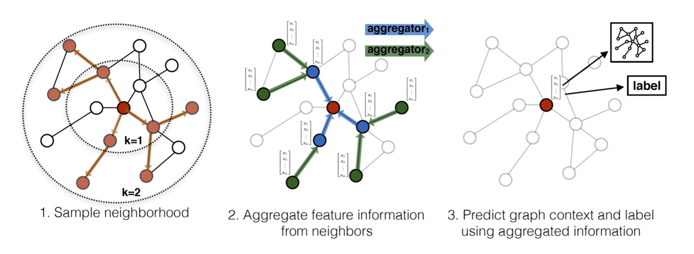

GraphSAGE
========
Introduction
-------------
`[paper] <https://dl.acm.org/doi/10.5555/3294771.3294869>`_

**Title:** Inductive representation learning on large graphs

**Authors:** William L. Hamilton, Rex Ying, Jure Leskovec

**Abstract:** Low-dimensional embeddings of nodes in large graphs have proved extremely useful in a variety of prediction
tasks, from content recommendation to identifying protein functions. However, most existing approaches require that all
nodes in the graph are present during training of the embeddings; these previous approaches are inherently transductive
and do not naturally generalize to unseen nodes. Here we present GraphSAGE, a general inductive framework that leverages
node feature information (e.g., text attributes) to efficiently generate node embeddings for previously unseen data.
Instead of training individual embeddings for each node, we learn a function that generates embeddings by sampling and
aggregating features from a node's local neighborhood. Our algorithm outperforms strong baselines on three inductive
node-classification benchmarks: we classify the category of unseen nodes in evolving information graphs based on citation
and Reddit post data, and we show that our algorithm generalizes to completely unseen graphs using a multi-graph dataset
of protein-protein interactions.

For source code, please refer to :ref:`BASE_GNN <faknow.model.social_context.base_gnn>`

If you want to change parameters, dataset or evaluation settings, take a look at

- :doc:`../../../../user_guide/config_intro`
- :doc:`../../../../user_guide/data_intro`
- :doc:`../../../../user_guide/train_eval_intro`
- :doc:`../../../../user_guide/usage`