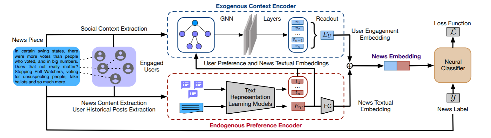

UPFD
====
Introduction
-------------
`[paper] <https://dl.acm.org/doi/abs/10.1145/3404835.3462990>`_

**Title:** User Preference-aware Fake News Detection

**Authors:** Yingtong Dou, Kai Shu, Congying Xia, Philip S. Yu, Lichao Sun

**Abstract:** Disinformation and fake news have posed detrimental effects on individuals and society in recent years,
attracting broad attention to fake news detection. The majority of existing fake news detection algorithms focus on mining
news content and/or the surrounding exogenous context for discovering deceptive signals; while the endogenous preference
of a user when he/she decides to spread a piece of fake news or not is ignored. The confirmation bias theory has indicated
that a user is more likely to spread a piece of fake news when it confirms his/her existing beliefs/preferences. Users'
historical, social engagements such as posts provide rich information about users' preferences toward news and have great
potentials to advance fake news detection. However, the work on exploring user preference for fake news detection is
somewhat limited. Therefore, in this paper, we study the novel problem of exploiting user preference for fake news detection.
We propose a new framework, UPFD, which simultaneously captures various signals from user preferences by joint content
and graph modeling. Experimental results on real-world datasets demonstrate the effectiveness of the proposed framework.
We release our code and data as a benchmark for GNN-based fake news detection: https://github.com/safe-graph/GNN-FakeNews.

Running with Faknow
---------------------
**Model Hyper-Parameters:**

- ``root (str)`` : Root directory where the dataset should be saved

- ``name (str)`` : The name of the graph set (:obj:`"politifact"`, :obj:`"gossipcop"`)

- ``feature (str)`` : The node feature type (:obj:`"profile"`, :obj:`"spacy"`, :obj:`"bert"`, :obj:`"content"`)
        If set to :obj:`"profile"`, the 10-dimensional node feature
        is composed of ten Twitter user profile attributes.
        If set to :obj:`"spacy"`, the 300-dimensional node feature is
        composed of Twitter user historical tweets encoded by
        the `spaCy word2vec encoder
        <https://spacy.io/models/en#en_core_web_lg>`_.
        If set to :obj:`"bert"`, the 768-dimensional node feature is
        composed of Twitter user historical tweets encoded by the
        `bert-as-service <https://github.com/hanxiao/bert-as-service>`_.
        If set to :obj:`"content"`, the 310-dimensional node feature is
        composed of a 300-dimensional "spacy" vector plus a
        10-dimensional "profile" vector.

- ``splits (List[str])`` : dataset split, including 'train', 'val' and 'test'.

        If None, ['train', 'val', 'test'] will be used, default = ``None``

- ``base_model (str)`` : base model for UPFD, including 'sage', 'gcn', 'gat', 'gcnfn', default = ``'sage'``

- ``batch_size (int)`` : batch size, default = ``128``

- ``epochs (int)`` : number of epochs, default = ``75``

- ``lr (float)`` : learning rate, default = ``0.01``

- ``weight_decay (float)`` : weight decay, default = ``0.01``

- ``metrics (List)`` : evaluation metrics, if None, ['accuracy', 'precision', 'recall', 'f1'] is used, default = ``None``

- ``device (str)`` : device, default = ``'cpu'``

**A Running Example:**

Write the following code to a python file, such as run.py

.. code:: python

    from faknow.run.social_context import run_upfd

    run_upfd(root=, name=, feature=)

And then:

.. code:: bash

   python run.py

If you want to change parameters, dataset or evaluation settings, take a look at

- :doc:`../../../../user_guide/config_intro`
- :doc:`../../../../user_guide/data_intro`
- :doc:`../../../../user_guide/train_eval_intro`
- :doc:`../../../../user_guide/usage`
