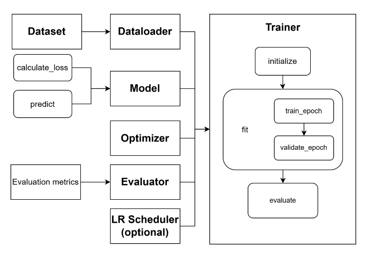

Trainer Module
==================================
To address the imperative of streamlining the training process for diverse models within FaKnow and alleviate the burden
of repetitive work, we have ingeniously devised the trainer module. Positioned after the aforementioned data module and model
module, this module assumes the crucial responsibility of ingesting the data into the model in batches.

It encompasses a plethora of essential functionalities, including but not limited to **model training**, **validation**, **testing**,
**saving**, **logging** of training progress, and **visualization** thereof. These functionalities are harmoniously encapsulated within
the class called Trainer, rendering it impervious to users’ intricate internalities. By simply specifying the desired model,
optimization algorithm, and other hyper-parameters, users can effortlessly expedite the training process. The trainer module
further embraces advanced settings, such as gradient clipping, the learning rate scheduler, and early stopping,
to accommodate divergent circumstances and demands.

Training process
-----------------

This diagram illustrates the workflow in Trainer. During the training process of the Trainer, adherence to established deep learning
model training protocols is maintained. This involves partitioning the data into three distinct subsets: the training set, the validation set, and the test set.
Following each training epoch, model validation is performed, while the model is tested only upon completion of all training epochs. Classification metrics including
accuracy, precision, recall, and F1 score are subsequently computed.

Auxiliary functionalities
------------------------
To enhance user convenience, the trainer module not only facilitates fundamental model training but also encompasses supplementary functionalities. Regarding model training, the Trainer seamlessly integrates numerous advanced configurations.

• **Gradient clipping**: is invoked during the training of every batch of data to avert gradient explosion

• **Learning rate scheduler**: adjusts the learning rate as instructed by the user after each epoch of training and validation to mitigate overfitting.

• **Early stopping**: determines whether to prematurely terminate the training process based on the model’s performance on the validation set in each iteration and save the model with the best performance on the validation set, alongside corresponding evaluation results from all iterations.

• **Logging**: shows training loss and validation results in the console and saves them to a local log file.

• **Visualization**: visualizes the fluctuation curves encompassing training loss and validation results (including accuracy and other metrics) from each iteration with TensorBoard5.

• **To device**: moves data and model to the specific device like Cuda or CPU. If the aforementioned features fail to cater to user requirements adequately, users may opt to inherit the Trainer class, thereby leveraging existing code as far as possible for developing new functionalities.
