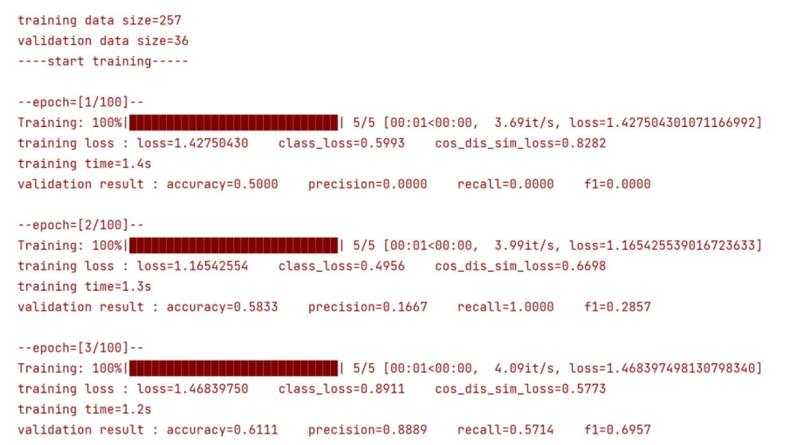
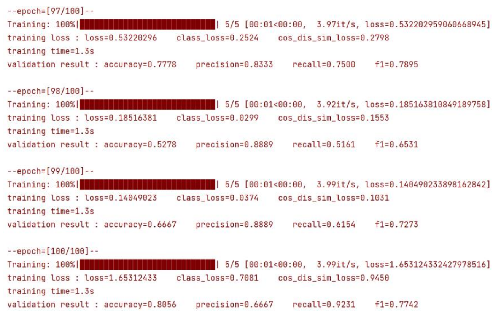

Progress Bar Visualization
===========================
During the training process, we will present the training status of the model in real-time in the form of a progress bar.
Here, take the training process of ``SAFE`` as an example.

At the beginning of the training, we will provide the size of the training dataset and the size of the validation dataset.
During the training process, we will provide the ``training time``, ``training loss``, ``classification loss``, and ``cosine distance
loss`` for each round; Verify the ``accuracy``, ``precision``, ``recall``, and ``F1 score`` on the set.

At the end of the training, we will provide the ``accuracy``, ``precision``, ``recall``, ``F1 score`` on the test set, as well as the path to save the model file.

