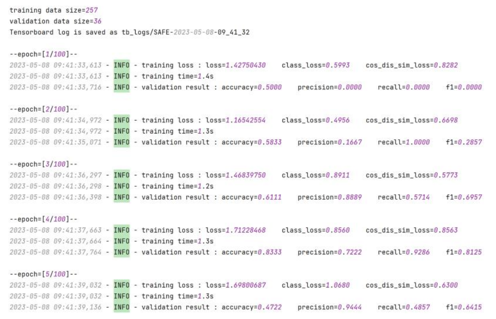

Log Visualization
==================
By retrieving the file name, we can open the corresponding log file to view the training log. The information in it is
basically consistent with the visualization process of the progress bar, and is saved as a log file for future viewing and research.

