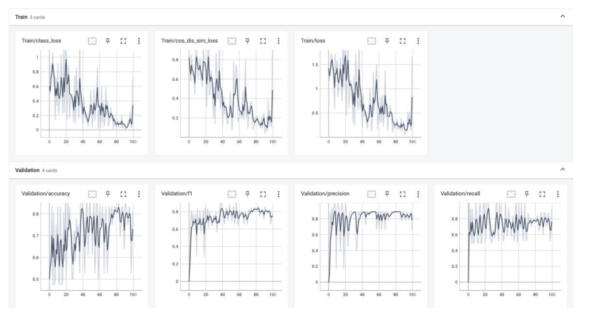

TensorBoard Visualization
=========================
By typing the command tensorboard -- logdir=SAFE YEAR MONTH DAY H-M-S in the command line window, Open http://localhost:6006/ ,
you can see the training curve graph.

